# 🌱 Carbon Footprint Analyzer

**AI-powered carbon footprint estimation from Indian bank statements using LangGraph**

Analyze your spending patterns and estimate carbon emissions with privacy-first PII redaction and hybrid rule-based + LLM categorization.

---

## 📊 Workflow Overview

```
┌─────────────────────────────────────────────────────────────────────────────┐
│                    CARBON FOOTPRINT ANALYSIS PIPELINE                        │
├─────────────────────────────────────────────────────────────────────────────┤
│                                                                              │
│  ┌──────────┐    ┌──────────────┐    ┌─────────────┐    ┌──────────────┐   │
│  │   PDF    │───▶│   Extract    │───▶│   Redact    │───▶│    Rule      │   │
│  │  Parser  │    │ Transactions │    │    PII      │    │ Categorize   │   │
│  │  Node 1  │    │   Node 2     │    │   Node 3    │    │   Node 4     │   │
│  └──────────┘    └──────────────┘    └─────────────┘    └──────┬───────┘   │
│       │                │                    │                   │           │
│   PyMuPDF          Groq LLM            Regex-based         Pattern         │
│   Text Extract   llama-3.3-70b         Filtering           Matching        │
│                                                                 │           │
│                                                                 ▼           │
│  ┌──────────┐    ┌──────────────┐    ┌─────────────┐    ┌──────────────┐   │
│  │ Generate │◀───│  Aggregate   │◀───│  Estimate   │◀───│     LLM      │   │
│  │ Insights │    │   Results    │    │   Carbon    │    │  Categorize  │   │
│  │  Node 8  │    │   Node 7     │    │   Node 6    │    │   Node 5     │   │
│  └──────────┘    └──────────────┘    └─────────────┘    └──────────────┘   │
│       │                │                    │                   │           │
│   AI-powered       Category &          Emission            Anthropic/       │
│   Recommendations  Monthly Totals      Factors             Groq LLM         │
│                                                                              │
└─────────────────────────────────────────────────────────────────────────────┘
```

---

## 🎯 Key Features

| Feature | Description |
|---------|-------------|
| 🔒 **Privacy-First** | PII redaction (mobile numbers, UPI IDs, account numbers) before LLM processing |
| ⚡ **Hybrid Efficiency** | Rule-based (80%) + LLM (20%) categorization for speed and cost |
| 🇮🇳 **India-Specific** | Emission factors from NSSO studies, supports all major Indian banks |
| 📊 **Min/Max Ranges** | Accounts for lifestyle variations (diet, energy sources, etc.) |
| 🤖 **Multi-LLM** | Supports Anthropic Claude and Groq Llama models |

---

## 🏗️ Project Structure

```
carbon_footprint_langgraph/
├── core/                           # Core components
│   ├── state.py                   # State definitions
│   ├── config.py                  # Configuration
│   └── llm_factory.py             # LLM initialization
├── nodes/                          # 8 Processing nodes
│   ├── pdf_parser.py              # Node 1: PDF text extraction
│   ├── transaction_extractor.py   # Node 2: LLM transaction extraction
│   ├── pii_redactor.py            # Node 3: PII redaction
│   ├── rule_categorizer.py        # Node 4: Pattern-based categorization
│   ├── llm_categorizer.py         # Node 5: AI categorization
│   ├── carbon_estimator.py        # Node 6: Emission calculation
│   ├── aggregator.py              # Node 7: Results aggregation
│   └── insights_generator.py      # Node 8: Recommendations
├── utils/                          # Utilities
│   ├── patterns.py                # Categories & emission factors
│   ├── sample_data.py             # Demo data
│   └── reporting.py               # Report generation
├── orchestrator.py                 # LangGraph workflow
├── streamlit_app.py                # Web interface
├── SpendCategory-EmissionFactor... # Source of truth for categories
└── requirements.txt
```

---

## 📋 Official Categories

Based on `SpendCategory-EmissionFactorkgCO2e1000.csv` (source of truth):

| Category | Emission Factor (kg CO2e/₹1000) | Examples |
|----------|--------------------------------|----------|
| 🍽️ Food & Groceries | 7 - 15 | Swiggy, BigBasket, restaurants |
| 🏠 Housing & Utilities | 10 - 20 | Electricity, rent, gas |
| 🚗 Transport | 20 - 40 | Uber, petrol, metro, flights |
| 👕 Clothing & Footwear | 5 - 10 | Myntra, Ajio, Zara |
| 🏠 Household Goods | 5 - 10 | Amazon, Flipkart, Croma |
| 💊 Healthcare & Personal Care | 3 - 7 | Apollo, pharmacies, salons |
| 📚 Education & Communication | 1 - 5 | Schools, Airtel, Jio |
| 🎬 Recreation & Leisure | 2 - 8 | Netflix, MakeMyTrip, PVR |
| 💰 Financial Services | 1 - 3 | Insurance, mutual funds |
| 📦 Miscellaneous | 2 - 6 | ATM, transfers, others |

---

## 🚀 Quick Start

### 1. Setup Environment

```bash
# Clone and setup
git clone <repo-url>
cd carbon_footprint_langgraph

# Create virtual environment
python -m venv venv
source venv/bin/activate  # Windows: .\venv\Scripts\activate

# Install dependencies
pip install -r requirements.txt

# Configure API keys
cp .env.example .env
# Edit .env and add your GROQ_API_KEY and/or ANTHROPIC_API_KEY
```

### 2. Run the Application

```bash
# Web interface (recommended)
streamlit run streamlit_app.py

# Or use the orchestrator directly
python orchestrator.py
```

### 3. Analyze Your Statement

1. Open http://localhost:8501
2. Upload your bank statement PDF
3. Select LLM provider (Groq recommended for extraction)
4. Click "Analyze Carbon Footprint"
5. View results, charts, and recommendations

---

## ⚙️ Configuration

### Environment Variables

```bash
# Required - at least one LLM provider
GROQ_API_KEY=gsk_...           # For transaction extraction (required)
ANTHROPIC_API_KEY=sk-ant-...   # For categorization (optional)

# Optional - LangSmith tracing
LANGCHAIN_TRACING_V2=true
LANGCHAIN_API_KEY=lsv2_...
LANGCHAIN_PROJECT=carbon-footprint
```

### LLM Usage

| Task | Provider | Model |
|------|----------|-------|
| Transaction Extraction | Groq | llama-3.3-70b-versatile |
| LLM Categorization | Configurable | Claude or Llama |
| Insights Generation | Configurable | Claude or Llama |

---

## 📈 How It Works

### Node-by-Node Flow

```mermaid
graph LR
    A[PDF Upload] --> B[Node 1: Parse PDF]
    B --> C[Node 2: Extract Transactions]
    C --> D[Node 3: Redact PII]
    D --> E[Node 4: Rule Categorize]
    E --> F[Node 5: LLM Categorize]
    F --> G[Node 6: Estimate Carbon]
    G --> H[Node 7: Aggregate]
    H --> I[Node 8: Generate Insights]
    I --> J[Results Dashboard]
    
    style B fill:#e1f5fe
    style C fill:#fff3e0
    style D fill:#fce4ec
    style E fill:#e8f5e9
    style F fill:#fff3e0
    style G fill:#f3e5f5
    style H fill:#e0f2f1
    style I fill:#fff8e1
```



### Detailed Node Descriptions

| Node | Input | Processing | Output |
|------|-------|------------|--------|
| **1. PDF Parser** | PDF file | PyMuPDF text extraction | Raw text |
| **2. Transaction Extractor** | Raw text | Groq LLM parsing | Structured transactions |
| **3. PII Redactor** | Transactions | Regex pattern matching | Redacted transactions |
| **4. Rule Categorizer** | Redacted txns | 200+ merchant patterns | Categorized (80%) |
| **5. LLM Categorizer** | Uncategorized | AI classification | Fully categorized |
| **6. Carbon Estimator** | Categories | Emission factors × amount | CO2e estimates |
| **7. Aggregator** | Estimates | Sum by category/month | Totals & breakdowns |
| **8. Insights Generator** | Aggregated | AI analysis | Recommendations |

---

## 🔒 Privacy & Compliance

### PII Redaction (DPDP Act 2023)

The system automatically redacts:
- 📱 Mobile numbers (10-digit patterns)
- 💳 UPI IDs (name@bank patterns)
- 🏦 Account numbers (8-18 digit patterns)
- 📧 Email addresses
- 🆔 PAN/Aadhaar patterns

**Only redacted descriptions are sent to LLMs** - sensitive data stays local.

---

## 📊 Sample Output

```
🌱 CARBON FOOTPRINT ANALYSIS
════════════════════════════════════════

📊 Summary
├─ Total Footprint: 158.45 - 316.90 kg CO2e
├─ Average Estimate: 237.68 kg CO2e
├─ Transactions Analyzed: 42 debits
└─ Trees to Offset: 11.3 trees/year

🏷️ Categorization Efficiency
├─ Rule-based: 34 transactions (81%)
├─ LLM-based: 8 transactions (19%)
└─ Processing Time: 8.2 seconds

📈 Top Categories
├─ 🚗 Transport: 42% (99.8 kg CO2e)
├─ 🏠 Housing: 28% (66.6 kg CO2e)
├─ 🍽️ Food: 18% (42.8 kg CO2e)
└─ 🛍️ Shopping: 12% (28.5 kg CO2e)

💡 Recommendations
├─ Consider carpooling or public transport
├─ Switch to LED bulbs and energy-efficient appliances
├─ Reduce food delivery, cook more at home
└─ Buy local products when possible
```

---

## 🛠️ Development

### Adding Merchant Patterns

Edit `utils/patterns.py`:

```python
INDIAN_MERCHANT_PATTERNS = {
    "food_and_groceries": [
        "swiggy", "zomato", "bigbasket",
        "your_new_merchant",  # Add here
    ],
    # ...
}
```

### Customizing Emission Factors

Edit `utils/patterns.py`:

```python
EMISSION_FACTORS = {
    "food_and_groceries": {
        "min": 7, "max": 15,  # Adjust these values
        "source": "Your source",
        "notes": "Your notes"
    },
    # ...
}
```

### Using the Orchestrator Programmatically

```python
from orchestrator import run_carbon_analysis

result = run_carbon_analysis(
    pdf_path="statement.pdf",
    password="pdf_password",  # if encrypted
    llm_provider="groq",
    llm_model="llama-3.3-70b-versatile"
)

print(f"Total: {result['total_carbon_kg_avg']:.2f} kg CO2e")
print(f"Categories: {result['category_breakdown']}")
```

---

## 📋 Requirements

- Python 3.10+
- Groq API key (required for transaction extraction)
- Anthropic API key (optional, for categorization)

### Key Dependencies

```
langchain>=0.3.0
langgraph>=0.2.0
langchain-anthropic>=0.3.0
langchain-groq>=0.2.0
streamlit>=1.40.0
pymupdf>=1.24.0
plotly>=5.0.0
pandas>=2.0.0
```

---

## 🤝 Contributing

1. Fork the repository
2. Create a feature branch
3. Make your changes
4. Test with sample data
5. Submit a pull request

---

## 📄 License

MIT License - see LICENSE file for details.

---

## 🙏 Acknowledgments

- **LangGraph** - Workflow orchestration
- **Anthropic & Groq** - LLM providers
- **NSSO** - Emission factor data
- **Indian Banking Standards** - Statement formats

---

**🌱 Start tracking your carbon footprint today!**

```bash
streamlit run streamlit_app.py
```
