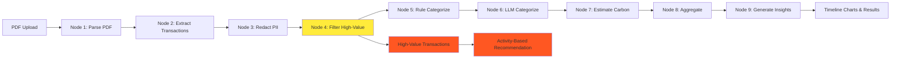

    # 🌱 Carbon Footprint Analyzer

**AI-powered carbon footprint estimation from Indian bank statements using LangGraph**

Analyze your spending patterns and estimate carbon emissions with privacy-first PII redaction, high-value transaction filtering, and hybrid rule-based + LLM categorization.

---

## 📊 Workflow Overview

```
┌─────────────────────────────────────────────────────────────────────────────┐
│                    CARBON FOOTPRINT ANALYSIS PIPELINE                        │
├─────────────────────────────────────────────────────────────────────────────┤
│                                                                              │
│  ┌──────────┐    ┌──────────────┐    ┌─────────────┐    ┌──────────────┐   │
│  │   PDF    │───▶│   Extract    │───▶│   Redact    │───▶│ Filter High  │   │
│  │  Parser  │    │ Transactions │    │    PII      │    │ Value Txns   │   │
│  │  Node 1  │    │   Node 2     │    │   Node 3    │    │   Node 4     │   │
│  └──────────┘    └──────────────┘    └─────────────┘    └──────┬───────┘   │
│       │                │                    │                   │           │
│   PyMuPDF          Groq LLM            Regex-based         ≥₹50,000        │
│   Text Extract   llama-3.3-70b         Filtering           Exclusion       │
│                                                                 │           │
│                                                                 ▼           │
│  ┌──────────┐    ┌──────────────┐    ┌─────────────┐    ┌──────────────┐   │
│  │   Rule   │───▶│     LLM      │───▶│  Estimate   │───▶│  Aggregate   │   │
│  │Categorize│    │  Categorize  │    │   Carbon    │    │   Results    │   │
│  │  Node 5  │    │   Node 6     │    │   Node 7    │    │   Node 8     │   │
│  └──────────┘    └──────────────┘    └─────────────┘    └──────┬───────┘   │
│       │                │                    │                   │           │
│   Pattern          Anthropic/          Emission            Category &       │
│   Matching         Groq LLM            Factors             Monthly Totals   │
│                                                                 │           │
│                                                                 ▼           │
│                                        ┌─────────────┐                      │
│                                        │ Generate    │                      │
│                                        │ Insights    │                      │
│                                        │  Node 9     │                      │
│                                        └─────────────┘                      │
│                                             │                               │
│                                        AI-powered                           │
│                                        Recommendations                      │
│                                                                              │
└─────────────────────────────────────────────────────────────────────────────┘
```

---

## 🎯 Key Features

| Feature | Description |
|---------|-------------|
| 🔒 **Privacy-First** | PII redaction (mobile numbers, UPI IDs, account numbers) before LLM processing |
| 💰 **High-Value Filtering** | Excludes transactions ≥₹50,000 from spend-based analysis (needs activity-based estimation) |
| ⚡ **Hybrid Efficiency** | Rule-based (80%) + LLM (20%) categorization for speed and cost |
| 🇮🇳 **India-Specific** | Emission factors from NSSO studies, supports all major Indian banks |
| 📊 **Min/Max Ranges** | Accounts for lifestyle variations (diet, energy sources, etc.) |
| 📈 **Timeline Analysis** | Weekly carbon footprint trends with urban India baseline comparison |
| 🤖 **Multi-LLM** | Supports Anthropic Claude and Groq Llama models |

---

## 🏗️ Project Structure

```
carbon_footprint_langgraph/
├── core/                           # Core components
│   ├── state.py                   # State definitions
│   ├── config.py                  # Configuration
│   └── llm_factory.py             # LLM initialization
├── nodes/                          # 9 Processing nodes
│   ├── pdf_parser.py              # Node 1: PDF text extraction
│   ├── transaction_extractor.py   # Node 2: LLM transaction extraction
│   ├── pii_redactor.py            # Node 3: PII redaction
│   ├── high_value_filter.py       # Node 4: High-value transaction filter (NEW)
│   ├── rule_categorizer.py        # Node 5: Pattern-based categorization
│   ├── llm_categorizer.py         # Node 6: AI categorization
│   ├── carbon_estimator.py        # Node 7: Emission calculation
│   ├── aggregator.py              # Node 8: Results aggregation
│   └── insights_generator.py      # Node 9: Recommendations
├── utils/                          # Utilities
│   ├── patterns.py                # Categories & emission factors
│   ├── sample_data.py             # Demo data
│   └── reporting.py               # Report generation
├── orchestrator.py                 # LangGraph workflow
├── streamlit_app.py                # Web interface with timeline charts
├── SpendCategory-EmissionFactor... # Source of truth for categories
└── requirements.txt
```

---

## 🚨 High-Value Transaction Handling

**NEW FEATURE**: Transactions ≥₹50,000 are automatically flagged and excluded from spend-based carbon estimation.

### Why Exclude High-Value Transactions?

| Transaction Type | Spend-Based Issue | Recommended Approach |
|------------------|-------------------|---------------------|
| 💻 Electronics (₹50K laptop) | Price ≠ Carbon footprint | Activity-based: ~300-400 kg CO2e |
| ✈️ International flights | Ticket price varies by booking time | Activity-based: Distance × emission factor |
| 🏠 Property/Vehicles | Lifecycle emissions unrelated to price | Activity-based: Product-specific factors |
| 💰 Investments/Insurance | No direct carbon emissions | Exclude from carbon analysis |

### How It Works

1. **Node 4** filters transactions before categorization
2. **High-value transactions** are flagged but not categorized
3. **Carbon estimation** only applies to regular transactions
4. **Results display** shows excluded transactions with recommendations

---

## 📈 Timeline Analysis & Benchmarking

**NEW FEATURE**: Weekly carbon footprint trends with urban India baseline comparison.

### Timeline Chart Features

- 📊 **Weekly aggregation** of carbon emissions
- 📈 **Min/Max ranges** showing lifestyle variation
- 🔶 **Urban India baseline** (dotted orange line at ~8.5 kg CO2e/week)
- 📋 **Comparison metrics** (above/below average)
- 🎯 **Trend analysis** (increasing/decreasing over time)

### Reference Context

| Benchmark | Weekly CO2e | Annual CO2e | Source |
|-----------|-------------|-------------|---------|
| **Urban India Average** | ~8.5 kg | ~450 kg | NSSO consumption studies |
| **National India Average** | ~4.6 kg | ~240 kg | Per capita emissions data |
| **Global Average** | ~9.6 kg | ~500 kg | World Bank data |

---

## 📊 Sample Output

```
🌱 CARBON FOOTPRINT ANALYSIS
════════════════════════════════════════

📊 Summary
├─ Total Footprint: 158.45 - 316.90 kg CO2e
├─ Average Estimate: 237.68 kg CO2e
├─ Transactions Analyzed: 42 debits
├─ High-Value Excluded: 3 transactions (₹2,15,000)
└─ Trees to Offset: 11.3 trees/year

🏷️ Categorization Efficiency
├─ Rule-based: 34 transactions (81%)
├─ LLM-based: 8 transactions (19%)
└─ Processing Time: 8.2 seconds

📈 Timeline Analysis
├─ Your Weekly Average: 9.2 kg CO2e
├─ vs Urban India: 0.7 kg above average
├─ Trend: Decreasing over time
└─ Highest Week: 15.3 kg CO2e

📈 Top Categories
├─ 🚗 Transport: 42% (99.8 kg CO2e)
├─ 🏠 Housing: 28% (66.6 kg CO2e)
├─ 🍽️ Food: 18% (42.8 kg CO2e)
└─ 🛍️ Shopping: 12% (28.5 kg CO2e)

⚠️ High-Value Transactions (Activity-Based Needed)
├─ Electronics Purchase: ₹85,000
├─ International Flight: ₹75,000
└─ Property Investment: ₹55,000

💡 Recommendations
├─ Consider carpooling or public transport
├─ Switch to LED bulbs and energy-efficient appliances
├─ Reduce food delivery, cook more at home
└─ For high-value items, use activity-based carbon calculators
```

---

## 🚀 Quick Start

### 1. Setup Environment

```bash
# Clone and setup
git clone <repo-url>
cd carbon_footprint_langgraph

# Create virtual environment
python -m venv venv
source venv/bin/activate  # Windows: .\venv\Scripts\activate

# Install dependencies
pip install -r requirements.txt

# Configure API keys
cp .env.example .env
# Edit .env and add your GROQ_API_KEY and/or ANTHROPIC_API_KEY
```

### 2. Run the Application

```bash
# Web interface (recommended)
streamlit run streamlit_app.py

# Or use the orchestrator directly
python orchestrator.py
```

### 3. Analyze Your Statement

1. Open http://localhost:8501
2. Upload your bank statement PDF
3. Select LLM provider (Groq recommended for extraction)
4. Click "Analyze Carbon Footprint"
5. View results, timeline charts, and recommendations
6. Check high-value transaction alerts for activity-based estimation

---

## 📈 How It Works

### Node-by-Node Flow (Updated)



### Detailed Node Descriptions (Updated)

| Node | Input | Processing | Output |
|------|-------|------------|--------|
| **1. PDF Parser** | PDF file | PyMuPDF text extraction | Raw text |
| **2. Transaction Extractor** | Raw text | Groq LLM parsing | Structured transactions |
| **3. PII Redactor** | Transactions | Regex pattern matching | Redacted transactions |
| **4. High-Value Filter** | Redacted txns | ≥₹50K threshold check | Regular + high-value splits |
| **5. Rule Categorizer** | Regular txns | 200+ merchant patterns | Categorized (80%) |
| **6. LLM Categorizer** | Uncategorized | AI classification | Fully categorized |
| **7. Carbon Estimator** | Categories | Emission factors × amount | CO2e estimates |
| **8. Aggregator** | Estimates | Sum by category/month/week | Totals & breakdowns |
| **9. Insights Generator** | Aggregated | AI analysis + timeline | Recommendations |

---

## 🔒 Privacy & Compliance

### PII Redaction (DPDP Act 2023)

The system automatically redacts:
- 📱 Mobile numbers (10-digit patterns)
- 💳 UPI IDs (name@bank patterns)
- 🏦 Account numbers (8-18 digit patterns)
- 📧 Email addresses
- 🆔 PAN/Aadhaar patterns

**Only redacted descriptions are sent to LLMs** - sensitive data stays local.

### High-Value Transaction Privacy

- High-value transactions (≥₹50,000) are **never sent to LLMs**
- Only transaction amount and truncated description stored locally
- Full transaction details remain in your local analysis only

---

## 🛠️ Development

### Configuring High-Value Threshold

Edit `nodes/high_value_filter.py`:

```python
# Adjust threshold as needed
HIGH_VALUE_THRESHOLD = 50000  # ₹50,000 (default)
```

### Adding Timeline Benchmarks

Edit `streamlit_app.py`:

```python
# Add new benchmark lines
urban_avg_weekly = 8.5  # kg CO2e per week
rural_avg_weekly = 4.0  # kg CO2e per week (example)
```

### Customizing Emission Factors

Edit `utils/patterns.py`:

```python
EMISSION_FACTORS = {
    "transport": {
        "min": 20, "max": 40,  # Adjust these values
        "source": "Your source",
        "notes": "Your notes"
    },
    # ...
}
```

---

## 📋 Requirements

- Python 3.10+
- Groq API key (required for transaction extraction)
- Anthropic API key (optional, for categorization)

### Key Dependencies

```
langchain>=0.3.0
langgraph>=0.2.0
langchain-anthropic>=0.3.0
langchain-groq>=0.2.0
streamlit>=1.40.0
pymupdf>=1.24.0
plotly>=5.0.0
pandas>=2.0.0
```

---

## 🤝 Contributing

1. Fork the repository
2. Create a feature branch
3. Make your changes
4. Test with sample data (including high-value transactions)
5. Submit a pull request

---

## 📄 License

MIT License - see LICENSE file for details.

---

## 🙏 Acknowledgments

- **LangGraph** - Workflow orchestration
- **Anthropic & Groq** - LLM providers
- **NSSO** - Emission factor data
- **Indian Banking Standards** - Statement formats
- **Urban India Carbon Studies** - Baseline benchmarking data

---

**🌱 Start tracking your carbon footprint today with intelligent high-value filtering and timeline analysis!**

```bash
streamlit run streamlit_app.py
```

